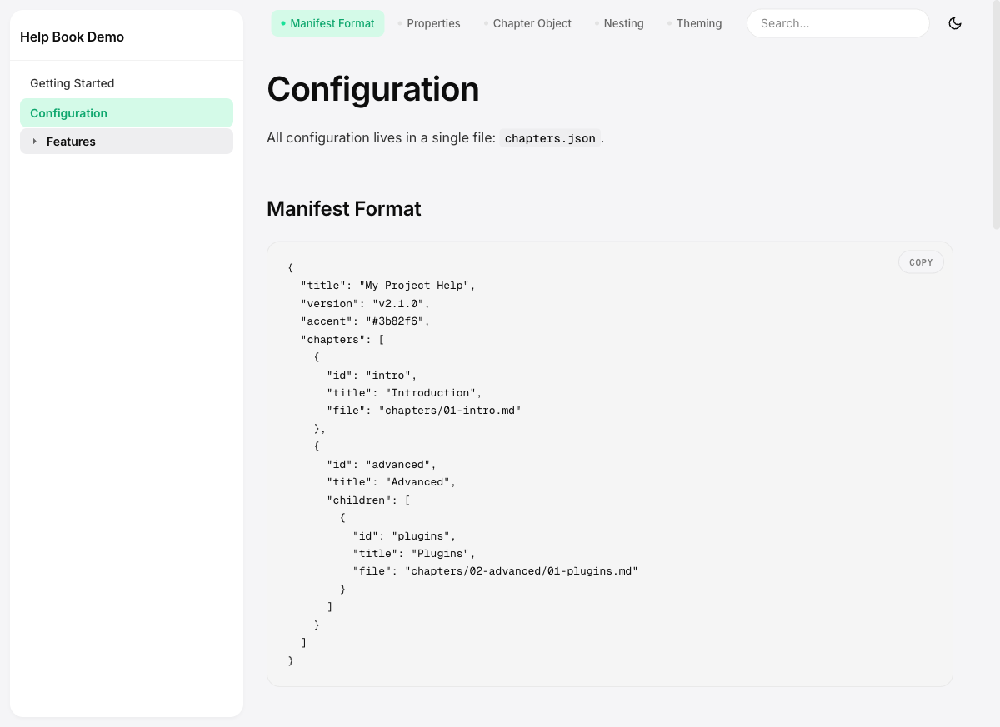
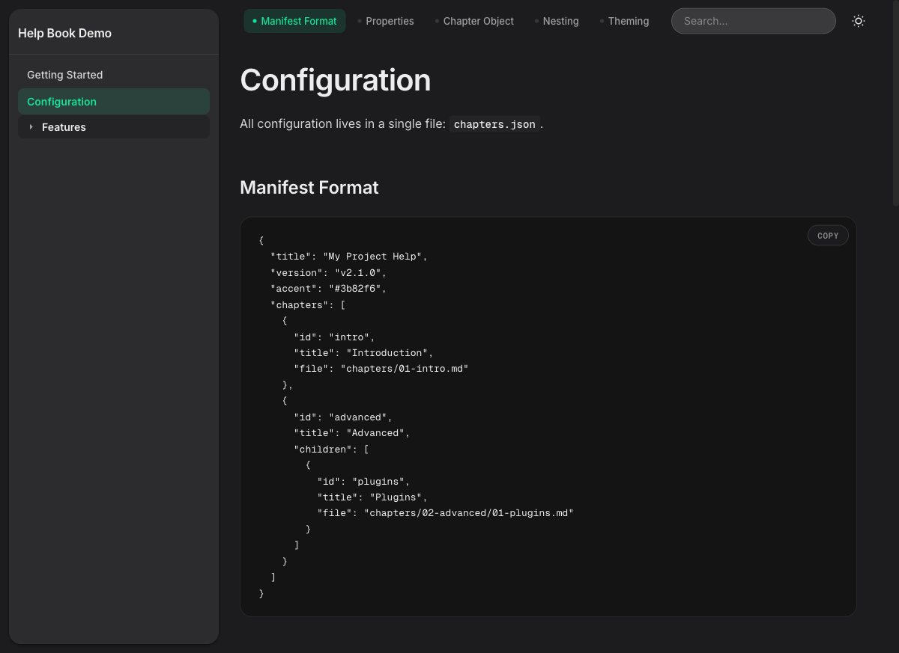

# Help Book

[](https://github.com/leminkozey/help-book/releases)
[](#license)
[](#)
[](#)

A standalone, drop-in documentation system for any web project. No build step, no npm, no framework — just static files. Mintlify-inspired aesthetic, macOS-Settings layout, dark mode out of the box.

> **Live demo:** https://leminkozey.github.io/help-book/help/

## Preview

| Light | Dark |
|---|---|
|  |  |

## What it does

Copy the `help/` folder into your project, edit `chapters.json`, write markdown — done. Your project has a full documentation site.

**Features:**
- Floating sidebar (macOS-Settings style) with auto-expanding nested chapters
- Inline TOC navigator in the sticky header (with scroll-spy)
- Full-text search across all chapters (`Ctrl+K` / `Cmd+K`), locale-aware, with indexing state
- Light / dark theme — follows system preference, syncs across tabs, no flash on first paint
- Geist Sans body + Geist Mono code labels (loaded from Google Fonts)
- Warm orange accent (`#e8791d`) — overridable per-project via `chapters.json`
- Pill-shaped search and copy buttons; subtle 5%-opacity borders
- Syntax highlighting (highlight.js) with copy-to-clipboard
- Mermaid diagram support — ```` ```mermaid ```` code blocks render as SVG (lazy-loaded from CDN, theme-aware)
- Chart.js support: ```` ```chart ```` code blocks with JSON config render as interactive charts (lazy-loaded from CDN, only when a chart appears on the page)
- Find-on-page: live highlights as you type, `Enter` / `Shift+Enter` to cycle, cross-chapter results below
- Heading anchors: hover an H2/H3 to reveal a `#` that copies a deep link to that section
- Optional "Edit this page on GitHub" link per chapter via `editUrl` in `chapters.json`
- Images via standard Markdown — paths resolve relative to the chapter file, raw `` allowed for sizing
- Previous / next chapter navigation
- Mobile responsive with safe-area insets (iPhone notch aware)
- Accessible: skip-link, ARIA combobox search, keyboard navigation, `prefers-reduced-motion`

## Quick Start

One line, in your project root:

```bash
curl -fsSL https://raw.githubusercontent.com/leminkozey/help-book/main/scripts/install.sh | bash
```

This drops a ready-to-edit `help/` folder next to where you ran it (with starter `chapters.json` + one demo chapter). Then serve it with any static file server:

```bash
cd help && python3 -m http.server 8082
```

> `python3 -m http.server` is for local development only — not production-ready (single-threaded, no TLS, no security headers). For production use nginx, Caddy, or a CDN.

Or with Express:

```javascript
app.use('/help', express.static('help', {
  dotfiles: 'deny',
  redirect: false,
  index: 'index.html'
}));
```

### Updating

After the first install, every `help/` folder comes with its own updater:

```bash
bash help/update          # → latest release
bash help/update v2.5.0   # → pin a specific version
```

The wrapper resolves the target relative to itself, so it works regardless of the directory you run it from. Your `chapters.json` and everything under `chapters/` is **never touched** — only the bundled code files are replaced.

Before overwriting anything, the previous code files are copied to `help/.help-book-backup/`. If the new release breaks something, roll back with:

```bash
cp help/.help-book-backup/*.* help/
cp help/.help-book-backup/update help/ 2>/dev/null
```

### Install Options

```bash
# Pin a specific version
curl -fsSL https://raw.githubusercontent.com/leminkozey/help-book/main/scripts/install.sh | bash -s v2.5.0

# Custom target directory (default: ./help)
HELP_BOOK_DIR=public/docs curl -fsSL https://raw.githubusercontent.com/leminkozey/help-book/main/scripts/install.sh | bash
```

The installer:
- **First run** — drops `index.html`, `help.css`, `help.js`, `logo.svg`, `update` plus a starter `chapters.json` + `chapters/01-getting-started.md`.
- **Subsequent runs** — overwrites only the code files. Your `chapters.json` and any markdown in `chapters/` is left untouched, and the previous code files get snapshotted to `help/.help-book-backup/` first.

> **Prefer to inspect first?** `curl -fsSL .../install.sh -o install.sh && less install.sh && bash install.sh`

### Manual download

If you don't want to run a remote script, grab the ZIP for the latest release:

```bash
TAG=$(curl -fsSL https://api.github.com/repos/leminkozey/help-book/releases/latest \
      | grep -m1 '"tag_name"' | cut -d'"' -f4)
curl -LO "https://github.com/leminkozey/help-book/releases/download/$TAG/help-book-$TAG.zip"
unzip -n "help-book-$TAG.zip" -d help/   # -n: never overwrite existing files
```

Or pin a specific version manually from the [releases page](https://github.com/leminkozey/help-book/releases) — the asset is always named `help-book-vX.Y.Z.zip`.

> The ZIP contains **only the five code files** (`index.html`, `help.css`, `help.js`, `logo.svg`, `update`). Your `chapters.json` and anything in `chapters/` is never overwritten — `unzip -n` is belt-and-suspenders against future archive changes.

### Final layout

```
your-project/
  help/
    index.html       # ← managed by installer
    help.css         # ← managed by installer
    help.js          # ← managed by installer
    logo.svg         # ← managed by installer
    update           # ← managed by installer (run with: bash help/update)
    chapters.json    # ← yours: edit freely
    chapters/        # ← yours: edit freely
      01-getting-started.md
```

## Configuration

Everything is configured in `chapters.json`:

```json
{
  "title": "My Project Help",
  "version": "v1.0.0",
  "accent": "#e8791d",
  "chapters": [
    {
      "id": "intro",
      "title": "Introduction",
      "file": "chapters/01-intro.md"
    },
    {
      "id": "advanced",
      "title": "Advanced",
      "children": [
        {
          "id": "plugins",
          "title": "Plugins",
          "file": "chapters/02-advanced/01-plugins.md"
        }
      ]
    }
  ]
}
```

| Property | Description |
|----------|-------------|
| `title` | Header and browser tab title |
| `version` | Shown in footer (optional) |
| `accent` | CSS accent color — accepts hex, `rgb(...)`, `hsl(...)`, `oklch(...)` (default: warm orange `#e8791d`) |
| `editUrl` | Optional URL template for an "Edit this page on GitHub" link rendered under each chapter. Use `{file}` as a placeholder for the chapter's `file` value, e.g. `https://github.com/you/repo/edit/main/help/{file}`. Omit the key to hide the link. |
| `chapters` | Ordered list of chapter objects |

Chapters can be nested one level deep. Parent chapters can optionally have their own `file`.

## Embedding Images

Images work the same way they do in regular Markdown — drop a file somewhere reachable by the static server and reference it from your chapter:

```markdown

```

If you need more control over sizing, fall back to a raw `` tag:

```html

```

The suggested layout is a per-chapters `images/` folder, referenced relative to the chapter file:

```
help/
  chapters/
    01-getting-started.md
    images/
      sidebar-dark.png
```

External URLs (`https://...`) work too, as long as the host allows hot-linking and your CSP permits the image source.

**A note on sanitization:** Markdown is rendered through `marked` and then scrubbed by DOMPurify. For `` only a small set of attributes survives — `src`, `alt`, `title`, `width`, `height`. Event handlers (`onerror`, `onload`, ...) and anything else get stripped. That's intentional, not a bug: it's what keeps user-supplied Markdown safe to render.

## Theming

Override CSS variables in `help.css` for deeper customization:

```css
:root {
  --help-accent: #3b82f6;
  --help-bg: #f5f5f7;
  --help-card-bg: #ffffff;
  --help-sidebar-w: 280px;
}
```

Dark mode follows the user's `prefers-color-scheme` by default. The user's manual choice is stored in `localStorage` and synced across tabs via the `storage` event. When storage is cleared, the system preference takes over again.

## Security

The library renders user-supplied Markdown — sanitization is critical. Built-in protections:

- **DOMPurify** with explicit allow-lists (no `<script>`, `<svg>`, `<form>`, `<iframe>`; URI scheme whitelist; controlled `target`/`rel`)
- **`chapters.json` validation** — `accent` must match a CSS color regex; `chapter.file` must match a path regex with traversal-depth guard
- **CSP `<meta>`** with strict allow-list; FOUC-preventing inline script needs `'unsafe-inline'` for `script-src`
- **SRI hashes** + `referrerpolicy="no-referrer"` on all CDN scripts
- **`Object.create(null)`** maps to defeat prototype pollution

For production deployments, set these HTTP headers via your reverse proxy:

```
X-Content-Type-Options: nosniff
X-Frame-Options: SAMEORIGIN
Referrer-Policy: no-referrer
Content-Security-Policy: default-src 'none'; script-src 'self' https://cdnjs.cloudflare.com https://cdn.jsdelivr.net 'unsafe-inline'; style-src 'self' https://cdnjs.cloudflare.com https://fonts.googleapis.com 'unsafe-inline'; img-src 'self' data:; connect-src 'self'; font-src 'self' data: https://fonts.gstatic.com; base-uri 'none'; form-action 'none'; frame-ancestors 'self'
```

Avoid symlinks inside `help/` — static servers may follow them and leak files outside the directory.

## Requirements

- A modern browser (Chrome, Firefox, Safari, Edge)
- A web server that can serve static files
- Internet access for Google Fonts + cdnjs (or self-host them)

## Releases

Versioned via SemVer. Tagging a `v*.*.*` triggers a [GitHub Action](.github/workflows/changelog.yml) that generates `CHANGELOG.md` entries from Conventional Commits and creates a GitHub Release. See [`CHANGELOG.md`](CHANGELOG.md) for the full history.

## License

MIT — see [`CHANGELOG.md`](CHANGELOG.md) for what changed in each version.
