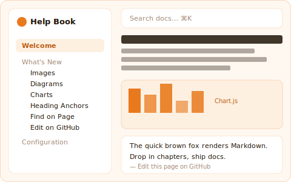

# Welcome

The Help Book is a standalone, drop-in documentation system for any web project. No build step, no npm, no framework — copy a folder, write Markdown, serve as static files.



This demo doubles as a showcase: every chapter under **What's New** demonstrates one of the features added in the latest release.

## Installation

One line, in your project root:

```bash
curl -fsSL https://raw.githubusercontent.com/leminkozey/help-book/main/scripts/install.sh | bash
```

This drops a ready-to-edit `help/` folder in the current directory with a starter `chapters.json` plus one demo chapter.

## Final layout

```
your-project/
  help/
    index.html       # ← managed by installer
    help.css         # ← managed by installer
    help.js          # ← managed by installer
    logo.svg         # ← managed by installer
    update           # ← managed by installer (run with: bash help/update)
    chapters.json    # ← yours: edit freely
    chapters/        # ← yours: edit freely
      01-getting-started.md
```

Then serve it as a static directory. For example with Express:

```javascript
app.use('/help', express.static('help'));
```

Or with a plain HTTP server for local development:

```bash
cd help && python3 -m http.server 8082
```

Your documentation is now available at `yoursite.com/help`.

## Updating

Every `help/` folder ships its own updater — no URL to memorize:

```bash
bash help/update          # → latest release
bash help/update v2.4.0   # → pin a specific version
```

Your `chapters.json` and everything under `chapters/` is **never touched**. Before overwriting the code files, the previous versions are snapshotted to `help/.help-book-backup/`, so you can roll back a bad update with a single copy.

## How It Works

1. **chapters.json** defines the structure — titles, order, and file paths
2. **Markdown files** in `chapters/` contain the actual content
3. **help.js** loads the manifest, builds the sidebar, and renders markdown on the fly
4. No build step, no dependencies to install — just static files

> **Tip:** Use `Ctrl+K` / `Cmd+K` to focus the search. Type two characters to start matching — see the **Find on Page** chapter for what happens next.

## Requirements

- A modern browser (Chrome, Firefox, Safari, Edge)
- A web server that can serve static files
- That's it.
