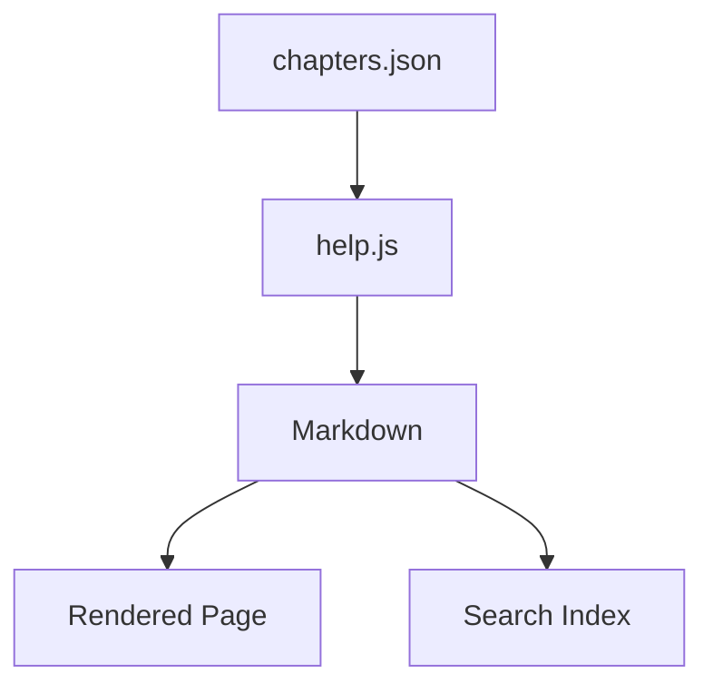

# Getting Started

Welcome to the Help Book — a standalone, drop-in documentation system for any web project.

## Installation

One line, in your project root:

```bash
curl -fsSL https://raw.githubusercontent.com/leminkozey/help-book/main/scripts/install.sh | bash
```

This drops a ready-to-edit `help/` folder in the current directory with a starter `chapters.json` plus one demo chapter.

### Final layout

```
your-project/
  help/
    index.html       # ← managed by installer
    help.css         # ← managed by installer
    help.js          # ← managed by installer
    logo.svg         # ← managed by installer
    update           # ← managed by installer (run with: bash help/update)
    chapters.json    # ← yours: edit freely
    chapters/        # ← yours: edit freely
      01-getting-started.md
```

Then serve it as a static directory. For example with Express:

```javascript
app.use('/help', express.static('help'));
```

Or with a plain HTTP server for local development:

```bash
cd help && python3 -m http.server 8082
```

Your documentation is now available at `yoursite.com/help`.

## Updating

Every `help/` folder ships its own updater — no URL to memorize:

```bash
bash help/update          # → latest release
bash help/update v2.4.0   # → pin a specific version
```

Your `chapters.json` and everything under `chapters/` is **never touched**. Before overwriting the code files, the previous versions are snapshotted to `help/.help-book-backup/`, so you can roll back a bad update with a single copy.

## How It Works

1. **chapters.json** defines the structure — titles, order, and file paths
2. **Markdown files** in `chapters/` contain the actual content
3. **help.js** loads the manifest, builds the sidebar, and renders markdown on the fly
4. No build step, no dependencies to install — just static files

## Quick Start

1. Edit `chapters.json` to set your project name, version, and chapters
2. Write your markdown files in `chapters/`
3. Done

> **Tip:** Use `Ctrl+K` / `Cmd+K` to quickly search across all chapters.

## Adding Images

Images use standard Markdown syntax — no special setup required:

```markdown

```

Renders as:


The suggested layout is an `images/` folder right next to your chapter files:

```
help/
  chapters/
    01-getting-started.md
    images/
      placeholder.svg
```

Paths are resolved relative to the chapter file, so the example above looks up `help/chapters/images/placeholder.svg`. External URLs (`https://...`) work too.

If you need more control — sizing, alignment via wrapper, etc. — drop in a raw `` tag:

```html

```

DOMPurify sanitizes every rendered chapter, so only safe attributes survive on ``: `src`, `alt`, `title`, `width`, `height`. Event handlers like `onerror` and unknown attributes get stripped — that's a feature, not a bug.

## Diagrams

You can embed [Mermaid](https://mermaid.js.org/) diagrams with a fenced code block tagged `mermaid`. The library is lazy-loaded from a CDN — chapters without diagrams never pay the cost.



## Charts

Fenced code blocks tagged `chart` render as interactive [Chart.js](https://www.chartjs.org/) charts. The library is lazy-loaded from CDN only when a chart appears on the page.

```chart
{
  "type": "bar",
  "data": {
    "labels": ["Jan", "Feb", "Mar", "Apr", "May"],
    "datasets": [{
      "label": "Downloads",
      "data": [120, 180, 240, 310, 420],
      "backgroundColor": "#e8791d"
    }]
  }
}
```

Pass any valid Chart.js config as JSON. Charts adapt to the active theme on toggle.

## Requirements

- A modern browser (Chrome, Firefox, Safari, Edge)
- A web server that can serve static files
- That's it. No npm, no webpack, no build pipeline.
