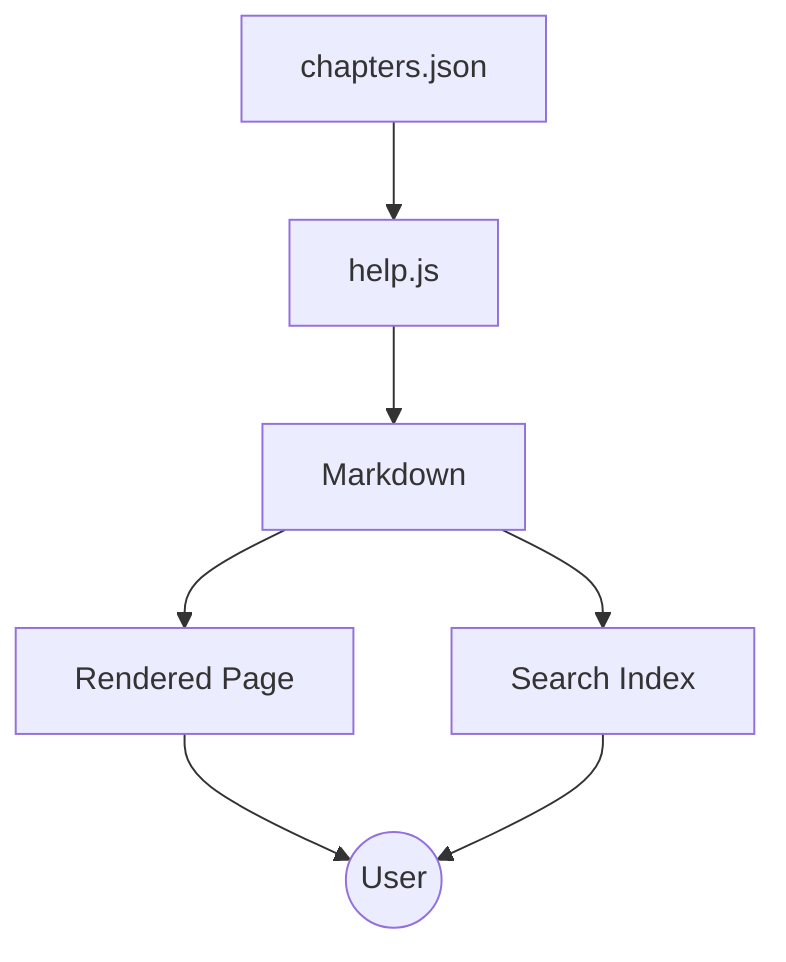
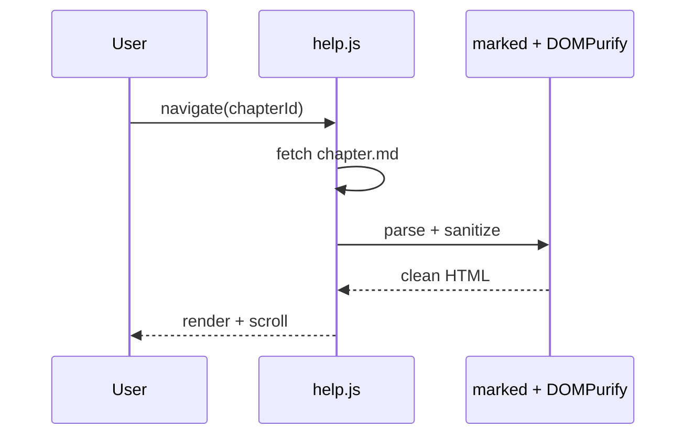
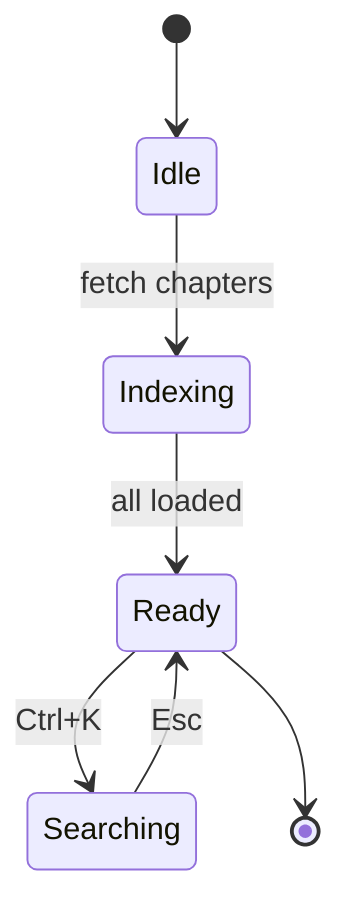

# Diagrams (Mermaid)

A fenced code block tagged `mermaid` renders as an SVG diagram. The library is lazy-loaded from `cdn.jsdelivr.net` — chapters without a diagram never pay the cost.

## Flowchart

## Sequence

## State

## Theme

Diagrams track the active theme. Toggle dark/light via the moon icon in the header and the SVG re-renders with the appropriate palette.

> The Mermaid integration uses `securityLevel: 'strict'` — embedded JS in diagrams is disabled.
